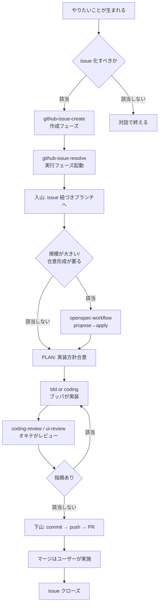

# matagi

Claude Code のスキル・ルール・ナレッジを共有するリポジトリ。日本の伝統的猟師集団「マタギ」をモチーフとした、モデル非依存で決定論的な開発ハーネス。「独自の厳格な掟（規約・Spec）」を絶対遵守し、集団で目的（issue の解決）を果たす思想を開発プロセスへ落とし込む。

根本規約（掟）は `AGENTS.md` を参照。全ツール・全エージェント、これに従う。

## マタギ用語集（抜粋）

役職・用語の唯一の正は `plugins/matagi/shared-rules/matagi-lore/glossary-rule.md`。外部呼び出し名（スキル名・コマンド名）は標準英語のまま保ち、内部コンテキストにのみ以下を注入する。

| 役職 | 役割 |
|------|------|
| シカリ（Shikari） | 全体指揮・オーケストレーター |
| セコ（Seko） | 獲物（コンテキスト・情報）を追い立てる探索者 |
| ブッパ（Buppa） | 仕様通り正確に撃ち抜く実装者 |
| オキテ（Okite） | 掟逸脱を許さぬ検証者。産出者とは常に別人格 |

山詞（ヤマコトバ）: 入山（着手）・下山（検証を経た完了）・ヤマダチ（1 issue = 1 branch = 1 PR の作業単位）

## 導入方法

GitHub から直接、マーケットプレイスプラグインとして導入する。

```bash
/plugin marketplace add kokuto821/matagi
/plugin install matagi
```

各リポジトリへ恒常的に導入したい場合は、`.claude/settings.json` に以下を追記する。

```json
{
  "enabledPlugins": {
    "matagi@matagi": true
  },
  "extraKnownMarketplaces": {
    "matagi": {
      "source": {
        "source": "github",
        "repo": "kokuto821/matagi"
      }
    }
  }
}
```

## ディレクトリ構造

構成と読み込みの仕組みは `ARCHITECTURE.md` を参照。

- `plugins/matagi/` … スキル・ルール・ドキュメント・ナレッジ・エージェント・テンプレートの本体
- `.claude-plugin/` … マーケットプレイスカタログ
- `.claude/` … このリポジトリ用の Claude Code ローカル設定

AI 向けのプロジェクト指示は `AGENTS.md` を参照。Claude Code は v2.1.277 以降で CLAUDE.md 不在時のフォールバックとして AGENTS.md をネイティブに読み込む。それ未満のバージョンでは自動ロードされないため、その場合は事前に `/memory` 等で読み込み状況を確認する。

## スキル一覧

| スキル | 役職 | 内容 |
|--------|------|------|
| `github-issue-resolve` | シカリ | issue の実行フェーズ（ブランチ作成〜PR〜クローズ）を統括 |
| `github-issue-create` | シカリ | issue 化の判断から issue 本文作成までを統括 |
| `openspec-workflow` | シカリ | OpenSpec の explore/propose/apply/archive を統括 |
| `tdd` | シカリ | List→Red→Green→Refactor→Commit の TDD サイクルを統括 |
| `hikitsugi` | セコ | 会話内容を再現性ある引き継ぎメモに整理 |
| `coding` | ブッパ | frontend/backend を判定し実装を委譲する単一入口 |
| `test-coding` | ブッパ | テスト観点洗い出しから失敗するテスト（TDD Red）を実装 |
| `create-ui-component` | ブッパ | ui-design ルールに沿って新規 UI コンポーネントを生成 |
| `lint-sync` | ブッパ | linter 対応ルールを既存 ESLint/Stylelint 設定へ反映 |
| `coding-review` | オキテ | コーディング規約・テスト規約の横断レビュー |
| `ui-review` | オキテ | UI 実装を ui-design ルールに照らしてレビュー |
| `ai-engineering-review` | オキテ | ステアリング資産をプロンプト品質・手法選択・コンテキストの3観点でレビュー |
| `harness-review` | オキテ | ステアリング手法の選択が公式意図通りかレビュー |
| `prompt-review` | オキテ | プロンプト・SKILL.md・エージェント定義をレビュー |
| `context-engineering-review` | オキテ | コンテキスト設計（注意予算・長時間軸戦略）をレビュー |
| `branch-and-push` | - | 未コミット変更のコミット単位提案からブランチ作成・push まで一気通貫 |
| `commit-message-simple` | - | issue 番号・プレフィックス付きコミットメッセージ生成 |
| `create-skill` | - | スキル・サブエージェントの新規作成 |
| `openspec-setup` | - | 作業リポジトリへの OpenSpec 導入 |
| `strict-mode` | - | 忖度なく正直な高レベルアドバイザーとして応答するモード |

## ワークフロー

issue 駆動開発と spec 駆動開発（OpenSpec）を組み合わせて進める。


